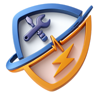
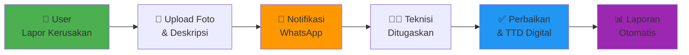
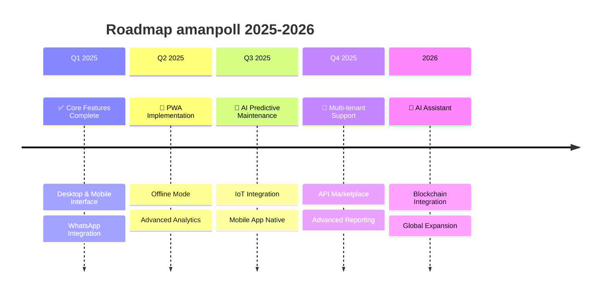

<div align="center">



# AMANPOLL

### Sistem Manajemen Aset & Pemeliharaan Modern

**Solusi Digital Terpadu untuk Pengelolaan Inventaris dan Pemeliharaan Aset**

[](https://react.dev/)
[](https://laravel.com/)
[](https://tailwindcss.com/)

---

### 🎯 Transformasi Digital untuk Manajemen Aset Anda

Tingkatkan efisiensi operasional hingga **70%** dengan sistem yang dirancang untuk kemudahan dan produktivitas maksimal.

[📱 Lihat Demo](#-demo) • [✨ Fitur Unggulan](#-fitur-unggulan) • [🏆 Keunggulan](#-mengapa-memilih-amanpoll) • [💼 Cocok Untuk](#-cocok-untuk-berbagai-industri)

</div>

---

## 🚀 Tentang AMANPOLL

**AMANPOLL** adalah sistem manajemen inventaris dan pemeliharaan aset berbasis web yang **modern, powerful, dan mudah digunakan**. Dibangun dengan teknologi terkini, sistem ini memberikan solusi lengkap untuk mengelola aset organisasi Anda dengan efisien.

### 💡 Masalah yang Kami Selesaikan

<table>
<tr>
<td width="50%">

#### ❌ Tantangan Tradisional
- Sulit melacak lokasi dan kondisi aset
- Pemeliharaan tidak terjadwal dengan baik
- Proses pelaporan kerusakan lambat
- Laporan manual memakan waktu
- Tidak bisa diakses mobile
- Data tidak real-time
- Biaya pemeliharaan membengkak

</td>
<td width="50%">

#### ✅ Solusi AMANPOLL
- **QR Code scanning** untuk tracking instant
- **Reminder otomatis** untuk jadwal pemeliharaan
- **Notifikasi WhatsApp** untuk respon cepat
- **Dashboard analytics** dengan visualisasi data
- **Mobile-friendly** dengan interface khusus
- **Real-time updates** untuk semua pengguna
- **Budget tracking** untuk kontrol biaya

</td>
</tr>
</table>

---

## 💼 Cocok untuk Berbagai Industri

amanpoll **dapat disesuaikan** untuk berbagai jenis organisasi:

<div align="center">

| 🏥 Kesehatan | 🏭 Manufaktur | 🏢 Perkantoran |
|:---:|:---:|:---:|
| Rumah Sakit, Klinik, Laboratorium | Pabrik, Gudang, Produksi | Kantor, Gedung, Fasilitas |
| **Manajemen alat medis & kalibrasi** | **Tracking mesin & peralatan** | **Inventaris aset IT & kantor** |

| 🏫 Pendidikan | 🏨 Hospitality | 🏗️ Konstruksi |
|:---:|:---:|:---:|
| Sekolah, Universitas, Kampus | Hotel, Resort, Restoran | Proyek, Site, Workshop |
| **Lab equipment & fasilitas** | **Maintenance fasilitas** | **Alat berat & equipment** |

</div>

---

## ✨ Fitur Unggulan

### 1️⃣ **Manajemen Inventaris Pintar**

<table>
<tr>
<td width="60%">

#### Kelola Semua Aset dalam Satu Platform

- 📦 **Database terpusat** untuk semua aset
- 🏷️ **QR Code otomatis** untuk setiap item
- 📸 **Upload foto, sertifikat, dan SOP**
- 📍 **Tracking lokasi real-time**
- 💰 **Perhitungan harga pengganti** dengan inflasi
- ⚠️ **Alert kalibrasi & expiry**
- 🖨️ **Print label QR Code** custom
- 🔍 **Pencarian advanced** dengan filter

</td>
<td width="40%">

```
┌─────────────────────┐
│   SCAN QR CODE      │
│                     │
│   ████████████      │
│   ██        ██      │
│   ██  ████  ██      │
│   ██  ████  ██      │
│   ██        ██      │
│   ████████████      │
│                     │
│  INV-2024-001       │
│  ECG Monitor        │
│  Ruang ICU          │
└─────────────────────┘
```

</td>
</tr>
</table>

---

### 2️⃣ **Sistem Pelaporan Kerusakan Digital**

<div align="center">



</div>

**Fitur Lengkap:**
- ✅ Pelaporan via **Desktop & Mobile**
- ✅ **Auto-generate nomor aduan** unik
- ✅ **Upload foto bukti** multiple
- ✅ **Assignment teknisi** otomatis
- ✅ **Status tracking** 4 tahap
- ✅ **Digital signature** untuk approval
- ✅ **WhatsApp notification** real-time
- ✅ **History lengkap** semua aktivitas

---

### 3️⃣ **Pemeliharaan Preventif Otomatis**

<table>
<tr>
<td width="50%">

#### 🔧 Jadwal Pemeliharaan Terencana

- 📅 **Scheduling otomatis** berdasarkan interval
- ⏰ **Reminder H-1** via notifikasi & WhatsApp
- ✅ **Checklist maintenance** per aset
- 📱 **Mobile inspection form**
- ✍️ **Digital signature workflow**
- 💰 **Tracking biaya pemeliharaan**
- 📋 **Rekomendasi tindakan**
- 📊 **Report otomatis**

</td>
<td width="50%">

#### 💡 Manfaat Pemeliharaan Preventif

> **Hemat hingga 40%** biaya perbaikan dengan pemeliharaan terencana

- 🎯 Mencegah kerusakan besar
- ⏱️ Memperpanjang usia aset
- 💵 Mengontrol budget maintenance
- 📈 Meningkatkan uptime equipment
- 📉 Mengurangi downtime tidak terduga

</td>
</tr>
</table>

---

### 4️⃣ **Dashboard Analytics Real-Time**

<div align="center">

#### 📊 Visualisasi Data untuk Keputusan Cepat


</div>

**Insight yang Anda Dapatkan:**
- 📈 **Grafik kondisi aset** (Pie Chart)
- 📊 **Status aduan** per periode (Bar Chart)
- 📉 **Trend pemeliharaan** (Line Chart)
- 🔔 **Alert kalibrasi expired** (30 hari sebelum & saat expired)
- ⏰ **Notifikasi jadwal pemeliharaan**
- 💰 **Budget tracking & RAB**
- 📱 **Akses dari Desktop & Mobile**

---

### 5️⃣ **Notifikasi Multi-Channel**

<table>
<tr>
<td align="center" width="33%">

### 📱 In-App


**Notifikasi real-time** di dalam aplikasi dengan badge counter

</td>
<td align="center" width="33%">

### 💬 WhatsApp


**Integrasi WhatsApp** untuk notifikasi instant ke teknisi

</td>
<td align="center" width="33%">

### ⏰ Auto Reminder


**Cron job otomatis** untuk reminder kalibrasi & pemeliharaan

</td>
</tr>
</table>

---

### 6️⃣ **Mobile-First Design**

<div align="center">

<table>
<tr>
<td align="center" width="25%">
<br/>
<b>Mobile Dashboard</b>
</td>
<td align="center" width="25%">
<br/>
<b>QR Scanner</b>
</td>
<td align="center" width="25%">
<br/>
<b>Form Aduan</b>
</td>
<td align="center" width="25%">
<br/>
<b>Pemeliharaan</b>
</td>
</tr>
</table>

</div>

**Fitur Mobile:**
- ✅ **Interface terpisah** untuk mobile
- ✅ **Touch-optimized** UI/UX
- ✅ **Camera capture** langsung
- ✅ **Voice input** untuk keluhan
- ✅ **QR Scanner** built-in
- ✅ **Offline-ready** (PWA)

---

## 🏆 Mengapa Memilih AMANPOLL?

<div align="center">

| 🎯 Fitur | 💼 Manfaat Bisnis | 📈 ROI |
|:---|:---|:---|
| **QR Code Tracking** | Lacak aset dalam hitungan detik | ⏱️ Hemat 80% waktu pencarian |
| **Pemeliharaan Preventif** | Cegah kerusakan sebelum terjadi | 💰 Hemat 40% biaya perbaikan |
| **Notifikasi Otomatis** | Respon cepat untuk setiap masalah | ⚡ Response time 90% lebih cepat |
| **Digital Signature** | Paperless & audit trail lengkap | 🌱 Hemat biaya administrasi |
| **Mobile Access** | Akses dimana saja, kapan saja | 📱 Produktivitas meningkat 50% |
| **Dashboard Analytics** | Keputusan berbasis data real-time | 📊 Efisiensi operasional 70% |

</div>

---

## 🎨 Teknologi Modern & Terpercaya

<div align="center">

### Stack Teknologi Terkini 2025

<table>
<tr>
<td align="center" width="50%">

#### 🎨 Frontend


**Modern, Cepat, Responsive**
- React 19 dengan concurrent features
- Vite untuk build ultra-cepat
- Tailwind CSS untuk UI modern
- TanStack Query untuk state management

</td>
<td align="center" width="50%">

#### ⚙️ Backend


**Robust, Scalable, Secure**
- Laravel 12 dengan PHP 8.2+
- Service-Repository architecture
- RESTful API dengan Sanctum auth
- MySQL database yang reliable

</td>
</tr>
</table>

</div>

---

## 📊 Statistik Sistem

<div align="center">

### Sistem yang Powerful & Lengkap

<table>
<tr>
<td align="center">
<h3>79+</h3>
<p>UI Components</p>
</td>
<td align="center">
<h3>23</h3>
<p>API Controllers</p>
</td>
<td align="center">
<h3>20</h3>
<p>Database Tables</p>
</td>
<td align="center">
<h3>19+</h3>
<p>Business Services</p>
</td>
</tr>
<tr>
<td align="center">
<h3>11</h3>
<p>Desktop Features</p>
</td>
<td align="center">
<h3>8</h3>
<p>Mobile Features</p>
</td>
<td align="center">
<h3>2</h3>
<p>Platform Layouts</p>
</td>
<td align="center">
<h3>100%</h3>
<p>Customizable</p>
</td>
</tr>
</table>

</div>

---

## 🎯 Fitur Lengkap dari A-Z

<details>
<summary><b>📦 Manajemen Inventaris</b></summary>

- ✅ CRUD inventaris lengkap
- ✅ QR Code generation otomatis (SVG)
- ✅ Upload foto aset, sertifikat, SOP
- ✅ Tracking kondisi real-time
- ✅ Perhitungan harga pengganti dengan inflasi
- ✅ Kalibrasi & expiry tracking
- ✅ Print label QR Code (standar & custom)
- ✅ Advanced search & filter
- ✅ Export data ke Excel
- ✅ Master data (kategori, nama alat, ruangan, divisi)

</details>

<details>
<summary><b>📢 Sistem Aduan</b></summary>

- ✅ Pelaporan via desktop/mobile
- ✅ Auto-generate nomor aduan
- ✅ Upload foto bukti (multiple)
- ✅ Assignment teknisi otomatis
- ✅ Status tracking 4 tahap
- ✅ Digital signature (teknisi & supervisor)
- ✅ Disposisi untuk approval
- ✅ History tracking lengkap
- ✅ WhatsApp notification
- ✅ Report aduan dengan filter

</details>

<details>
<summary><b>🔧 Pemeliharaan Preventif</b></summary>

- ✅ Jadwal pemeliharaan otomatis
- ✅ Auto-generate nomor pemeliharaan
- ✅ Checklist maintenance per aset
- ✅ Reminder notification (H-1)
- ✅ Mobile inspection form
- ✅ Digital signature workflow
- ✅ Biaya & rekomendasi tracking
- ✅ Report pemeliharaan
- ✅ Disposisi tindakan lanjutan

</details>

<details>
<summary><b>📊 Dashboard & Analytics</b></summary>

- ✅ Real-time statistics & KPI
- ✅ Grafik kondisi aset (Pie Chart)
- ✅ Grafik status aduan (Bar Chart)
- ✅ Grafik pemeliharaan (Line Chart)
- ✅ Notifikasi kalibrasi expired
- ✅ Notifikasi jadwal pemeliharaan
- ✅ Desktop & mobile version
- ✅ Customizable dashboard

</details>

<details>
<summary><b>🔔 Notifikasi & Reminder</b></summary>

- ✅ In-app notification dengan badge
- ✅ WhatsApp integration (Fonnte API)
- ✅ Auto reminder kalibrasi (30 hari sebelum)
- ✅ Auto reminder kalibrasi expired (daily)
- ✅ Auto reminder pemeliharaan (H-1)
- ✅ Notification center (desktop)
- ✅ Mobile notification list
- ✅ Email notification (optional)

</details>

<details>
<summary><b>📱 Mobile Features</b></summary>

- ✅ Separate mobile interface
- ✅ Touch-optimized UI
- ✅ Camera capture
- ✅ Voice input
- ✅ QR Scanner built-in
- ✅ Offline-ready (PWA potential)
- ✅ Mobile dashboard
- ✅ Mobile forms

</details>

<details>
<summary><b>📈 Pelaporan & Export</b></summary>

- ✅ Report aduan (filter lengkap)
- ✅ Report pemeliharaan
- ✅ Export to PDF
- ✅ Export to Excel
- ✅ Detail report dengan chart
- ✅ Budget & RAB calculation
- ✅ Print label QR Code

</details>

<details>
<summary><b>⚙️ Pengaturan & Konfigurasi</b></summary>

- ✅ Konfigurasi institusi (nama, logo, alamat)
- ✅ Konfigurasi integrasi (WhatsApp API)
- ✅ User management
- ✅ Role-based access control
- ✅ Master data management
- ✅ System settings

</details>

---

## 🔐 Keamanan & Kontrol Akses

<div align="center">

| Fitur Keamanan | Deskripsi |
|:---|:---|
| 🔒 **Token Authentication** | Laravel Sanctum untuk API security |
| 👥 **Role-Based Access** | Admin, Teknisi, Supervisor, Pimpinan |
| 🛡️ **Protected Routes** | Frontend & backend route protection |
| 🌐 **CORS Security** | Secure API access configuration |
| 🔑 **Password Encryption** | Bcrypt hashing untuk password |
| 📝 **Audit Trail** | History tracking semua aktivitas |
| 🔐 **Session Management** | Secure session handling |

</div>

---

## 💎 Paket & Layanan

<div align="center">

### Pilih Paket yang Sesuai Kebutuhan Anda

<table>
<tr>
<td align="center" width="33%">

### 🥉 STARTER
**Cocok untuk UKM**

💰 **Harga Terjangkau**

- ✅ 1 Lokasi
- ✅ 500 Aset
- ✅ 3 User
- ✅ Fitur Dasar
- ✅ Support Email
- ✅ Update Gratis 1 Tahun

</td>
<td align="center" width="33%">

### 🥈 PROFESSIONAL
**Untuk Perusahaan Menengah**

💰 **Best Value**

- ✅ 5 Lokasi
- ✅ 2000 Aset
- ✅ 15 User
- ✅ Semua Fitur
- ✅ WhatsApp Integration
- ✅ Support Priority
- ✅ Update Gratis 2 Tahun

</td>
<td align="center" width="33%">

### 🥇 ENTERPRISE
**Solusi Korporat**

💰 **Custom Pricing**

- ✅ Unlimited Lokasi
- ✅ Unlimited Aset
- ✅ Unlimited User
- ✅ Custom Features
- ✅ Dedicated Support
- ✅ On-Premise Option
- ✅ Lifetime Updates

</td>
</tr>
</table>

</div>

---

## 🎬 Demo & Screenshots

<div align="center">

### 🖥️ Desktop Interface


---

### 📱 Mobile Interface

<table>
<tr>
<td align="center">
<br/>
<b>Dashboard Mobile</b>
</td>
<td align="center">
<br/>
<b>QR Code Scanner</b>
</td>
<td align="center">
<br/>
<b>Form Pelaporan</b>
</td>
</tr>
</table>

---

### 📊 Reporting & Analytics


</div>

---

## 🌟 Testimoni Client

<div align="center">

> *"Sistem ini mengubah cara kami mengelola aset. Tracking jadi mudah dengan QR Code, dan notifikasi WhatsApp sangat membantu!"*
> 
> **— Direktur Operasional, Perusahaan Manufaktur**

---

> *"Pemeliharaan preventif otomatis menghemat biaya perbaikan kami hingga 40%. ROI tercapai dalam 6 bulan!"*
> 
> **— Manager Fasilitas, Rumah Sakit Swasta**

---

> *"Interface mobile-nya sangat user-friendly. Teknisi kami bisa langsung input data di lapangan."*
> 
> **— IT Manager, Universitas**

</div>

---

## 📞 Hubungi Kami

<div align="center">

### 💼 Tertarik untuk Demo atau Konsultasi?

**Kami siap membantu transformasi digital organisasi Anda!**

📧 **Email**: sales@amanpoll.com  
💬 **WhatsApp**: +62 812-3456-7890  
🌐 **Website**: www.amanpoll.com  
📍 **Alamat**: Jakarta, Indonesia

---

### 🎁 Promo Spesial

**Dapatkan DISKON 20% untuk 10 client pertama!**

[📅 Jadwalkan Demo](mailto:sales@amanpoll.com) • [💬 Chat WhatsApp](https://wa.me/628123456789) • [🌐 Kunjungi Website](#)

</div>

---

## 🚀 Roadmap Pengembangan

<div align="center">



</div>

---

## 📄 Lisensi & Dukungan

- ✅ **Lisensi**: Proprietary Software
- ✅ **Support**: Email, WhatsApp, Phone
- ✅ **Update**: Regular updates & security patches
- ✅ **Training**: Gratis training untuk tim Anda
- ✅ **Dokumentasi**: Lengkap & mudah dipahami
- ✅ **Customization**: Sesuai kebutuhan bisnis Anda

---

<div align="center">

## 🎯 Siap Transformasi Digital?

### Bergabunglah dengan 100+ Organisasi yang Telah Mempercayai AMANPOLL

**Tingkatkan efisiensi, kurangi biaya, dan maksimalkan produktivitas aset Anda!**

<br/>

[](mailto:sales@amanpoll.com)
[](https://wa.me/628123456789)
[](#)

---


**AMANPOLL** - Solusi Manajemen Aset Modern untuk Masa Depan

*Made with ❤️ in Indonesia*

---

⭐ **Star repository ini jika Anda tertarik dengan produk kami!**

[⬆ Kembali ke Atas](#amanpoll)

</div>
